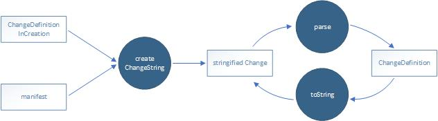

# @ui5/flexibility-utils

## Description
This project provides an API to create SAPUI5 flexibility change files outside of a OpenUI5 and SAPUI5 runtime.

This API allows you to create UI5 flexibility changes without a UI5 runtime, and without the need to understand how UI5 works internally.

## Requirements
* Node.js

## Installation
~~~
npm install @ui5/flexibility-utils
~~~

## Usage
~~~js
flexibilityUtils = require("@ui5/flexibility-utils");
let changeDefinitionInCreation = {...}
let stringifiedChange = flexibilityUtils.change.createChangeString(changeDefinitionInCreation, manifest)
let changeDefinition = flexibilityUtils.change.parse(stringifiedChange)
stringifiedChange = flexibilityUtils.change.toString(changeDefinition)
~~~

For more details about the functions and types, see the [JSDoc](jsdoc/index.html).

## Known Issues
No issues are currently known.

## How to obtain support
In case you need any support, please create a GitHub issue.

## License
Copyright (c) 2020 SAP SE or an SAP affiliate company. All rights reserved. This file and all other files in this repository are licensed under the Apache License, v 2.0 except as noted otherwise in the [LICENSE file](LICENSE.txt).

